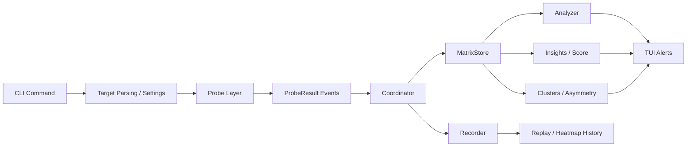

# Software Requirements Specification

## Project

`meshping`  
Version: `0.1.0`  
Document status: Current product SRS  
Document date: `2026-05-05`

## 1. Introduction

### 1.1 Purpose

This document defines the software requirements for `meshping`, a terminal-first network health and diagnosis tool. The goal of the product is to measure path latency across one or more targets, identify instability or failures, explain the likely cause in plain English, and present the results in an interactive terminal interface.

### 1.2 Scope

`meshping` is designed for developers, operators, students, and support engineers who need a lightweight way to answer questions such as:

- Is the network path healthy?
- Is the slowdown local to this machine, inside the LAN, or upstream on the internet?
- Is a target intermittently slow, lossy, or unreachable?
- Is IPv6 behaving worse than IPv4?
- Are some nodes topologically close to each other?
- Can a network incident be recorded and replayed later?

The product focuses on diagnosis and observability. It does not position itself as a load generator or stress-testing tool in the main user-facing workflow.

### 1.3 Definitions

- `RTT`: Round-trip time for one probe.
- `Latency`: User-facing wording for RTT.
- `p50`: Median RTT in the rolling window.
- `p99`: Tail RTT in the rolling window.
- `Jitter`: Average variation between consecutive RTT samples.
- `Loss`: Percentage of failed probes in the rolling window.
- `Stability %`: A derived score from loss, jitter, and tail spread.
- `Agentless mode`: One local machine probes many targets directly.
- `Distributed mode`: Remote meshping agents send measurements back to a coordinator.
- `Split-brain diagnosis`: Logic that distinguishes local gateway issues from upstream internet issues.
- `.mpr`: Binary replay recording format used by meshping.

### 1.4 Intended Audience

- Developers monitoring local services
- Infrastructure or support teams diagnosing connectivity issues
- Students presenting a network monitoring and diagnosis project
- Users who want terminal-native observability without deploying a metrics stack

## 2. Overall Description

### 2.1 Product Perspective

`meshping` is a standalone Python CLI application. It runs directly in a terminal, uses asynchronous probing, and renders a live terminal dashboard using Rich. The system supports both local single-node monitoring and distributed multi-node measurement.

The product architecture is centered around a measurement pipeline:



### 2.2 Product Functions

The system shall provide:

- one-shot probing of one or more targets
- live TUI monitoring for multiple targets
- distributed mesh mode using remote agents
- subnet discovery of running agents
- plain-English health explanations and a 0-100 health score
- split-brain diagnosis for local versus upstream faults
- IPv4 versus IPv6 path comparison
- cluster and asymmetry analysis
- replay recording and playback
- optional SQLite history logging
- local CPU, RAM, loopback, and NIC correlation in the TUI

### 2.3 User Classes

- `Casual operator`: wants a quick yes/no answer and readable diagnosis
- `Developer`: monitors local services and compares dependencies
- `Advanced user`: runs distributed agents and interprets topology or routing issues
- `Instructor / evaluator`: reviews architecture, features, and measurable outputs

### 2.4 Operating Environment

- OS: macOS, Linux, Windows-compatible Python runtime where supported by dependencies
- Language runtime: Python `>= 3.11`
- Terminal: interactive shell with ANSI color support
- Network: LAN and/or internet access depending on the command used

### 2.5 Dependencies

Core libraries used by the product:

- `click`: CLI parsing and command structure
- `pydantic`: typed configuration and model validation
- `rich`: terminal rendering and dashboard UI
- `structlog`: structured logging
- `aiohttp`: async HTTP functionality where needed
- `aiodns`: asynchronous DNS support
- `plotext`: terminal graph rendering
- `uvloop`: faster event loop on non-Windows platforms
- Python standard library modules such as `asyncio`, `socket`, `sqlite3`, `struct`, `json`, and `pathlib`

### 2.6 Constraints

- The application is terminal-first; there is no web dashboard.
- Normal operation should not require a database file.
- Local history is memory-first; SQLite logging is opt-in.
- The main product surface prioritizes health measurement and diagnosis over active stressing.
- Distributed mode depends on reachable UDP agent endpoints.

### 2.7 Assumptions

- Target hosts and ports are reachable from the probing machine unless the feature is specifically diagnosing failure.
- The user has permission to probe the chosen targets.
- Local gateway and DNS information can be read from the host operating system.

## 3. External Interface Requirements

### 3.1 Command-Line Interface

The main entry point is:

```bash
meshping
```

Supported user-facing commands:

- `meshping`
- `meshping probe`
- `meshping mesh`
- `meshping top`
- `meshping diff`
- `meshping check`
- `meshping doctor`
- `meshping discover`
- `meshping agent`
- `meshping replay`
- `meshping demo`
- `meshping "natural language query"`

### 3.2 Display Interface

The live interface shall render:

- a latency matrix
- per-link status text
- a 0-100 health score
- alert panel
- stats panel
- cluster view
- heatmap view
- local machine panel
- time-series and histogram views

### 3.3 File Interfaces

The system may read or write:

- `.mpr` replay files
- SQLite history files when `--log` is set
- JSON snapshot exports when `--export` is set
- CSV heatmap exports from stored history

### 3.4 Network Interfaces

The system uses:

- TCP connect probes for default target measurement
- ICMP probes in probe mode when selected
- UDP request/response for distributed agent measurement
- UDP discovery packets for LAN agent discovery

## 4. System Features and Functional Requirements

### 4.1 Default Sandbox Session

**Description**  
When the user runs `meshping` with no arguments, the product opens a safe live monitoring session against a built-in sandbox target set.

**Requirements**

- `FR-1`: The system shall start the live matrix session when no subcommand is provided.
- `FR-2`: The default session shall use safe sandbox targets such as Cloudflare, Google, and the local router.
- `FR-3`: The default session shall show the local system panel by default.

### 4.2 Natural-Language Shortcut

**Description**  
The user may provide a plain-English request instead of a formal command line.

**Requirements**

- `FR-4`: The system shall accept free-text input after the `meshping` command.
- `FR-5`: The system shall map the text to an internal monitoring workflow.

### 4.3 One-Shot Probe

**Description**  
The user can probe one or more targets once and view a simple result table.

**Requirements**

- `FR-6`: The system shall accept one or more targets as `name=host:port` or `host:port`.
- `FR-7`: The system shall support TCP probing by default.
- `FR-8`: The system shall support ICMP probe mode when requested.
- `FR-9`: The system shall support UDP agent probing when requested.
- `FR-10`: The system shall display result status, probe type, and RTT for each target.

### 4.4 Live Mesh Monitoring

**Description**  
The user can run a live terminal matrix against a target set and watch rolling network health.

**Requirements**

- `FR-11`: The system shall repeatedly probe all configured targets at a configurable interval.
- `FR-12`: The system shall maintain rolling per-link statistics including `p50`, `p99`, `loss_pct`, `jitter_ms`, and `stability_pct`.
- `FR-13`: The system shall display alerts and per-link status in the TUI.
- `FR-14`: The system shall support `--once` for a single static pass in agentless mode.
- `FR-15`: The system shall support optional JSON snapshot export.
- `FR-16`: The system shall support optional replay recording and optional SQLite history logging.

### 4.5 Top View

**Description**  
The top view combines network health with local machine resource information.

**Requirements**

- `FR-17`: The system shall show latency and local machine health in the same interface.
- `FR-18`: The system shall collect loopback, CPU, RAM, and NIC information for the local panel.

### 4.6 Diff Mode

**Description**  
The user can compare two targets side by side.

**Requirements**

- `FR-19`: The system shall probe two target definitions and compute comparable health metrics.
- `FR-20`: The system shall display a clear comparative verdict.

### 4.7 Check Mode

**Description**  
The user can run a script-friendly health check that returns a process exit code.

**Requirements**

- `FR-21`: The system shall evaluate thresholds such as `max-p99` and `max-loss`.
- `FR-22`: The system shall return exit code `0` for pass and `1` for failure.

### 4.8 Doctor Mode

**Description**  
The user can run a short diagnosis that explains likely causes of network trouble.

**Requirements**

- `FR-23`: The system shall test loopback, default gateway, DNS, public internet, IPv6, MTU behavior, outbound ports, and local NIC/TCP health.
- `FR-24`: The system shall implement split-brain diagnosis.
- `FR-25`: The system shall classify gateway-slow plus internet-slow conditions as likely local Wi-Fi or LAN issues.
- `FR-26`: The system shall classify gateway-healthy plus internet-slow conditions as likely ISP or upstream path issues.

### 4.9 Distributed Agent Mode

**Description**  
The system supports a true node-to-node mesh using remote agents.

**Requirements**

- `FR-27`: The system shall run a UDP agent service on remote nodes.
- `FR-28`: The coordinator shall receive `ProbeResult` reports from multiple agents.
- `FR-29`: The distributed coordinator shall analyze those reports using the same matrix and alert pipeline as agentless mode.

### 4.10 Agent Discovery

**Description**  
The system can discover running agents on a subnet.

**Requirements**

- `FR-30`: The system shall send discovery requests to the configured subnet.
- `FR-31`: The system shall display discovered agents with address and port details.

### 4.11 Replay

**Description**  
The system can record a live session and replay it later.

**Requirements**

- `FR-32`: The system shall write `.mpr` replay files when recording is enabled.
- `FR-33`: The replay subsystem shall rebuild coordinator state from recorded events.
- `FR-34`: The replay viewer shall support pause, speed control, seek, and progress markers.

### 4.12 Demo Mode

**Description**  
The system includes a single-command localhost demo for presentation and testing.

**Requirements**

- `FR-35`: The system shall start the local demo services and open the matrix in one command.
- `FR-36`: The demo shall simulate an 8-service adjacency matrix on one machine.

### 4.13 Rolling Network Intelligence

**Description**  
The system shall derive meaningful network behavior from repeated probe results.

**Requirements**

- `FR-37`: The system shall compute rolling `p50` and `p99` per path.
- `FR-38`: The system shall compute jitter from consecutive sample deltas.
- `FR-39`: The system shall compute rolling loss percentage from failed samples.
- `FR-40`: The system shall maintain a baseline latency for anomaly comparison.
- `FR-41`: The system shall compute a stability percentage from loss, jitter, and tail spread.

### 4.14 Alerting and Diagnosis Logic

**Description**  
The product shall identify meaningful path failures and degradations.

**Requirements**

- `FR-42`: The system shall detect spike alerts when current latency exceeds the configured factor over baseline.
- `FR-43`: The system shall detect loss alerts when rolling loss exceeds the configured threshold.
- `FR-44`: The system shall detect node-down alerts from repeated consecutive failures.
- `FR-45`: The system shall detect route changes from persistent rolling divergence versus baseline.
- `FR-46`: The system shall detect path asymmetry when `A->B` and `B->A` differ beyond a configured threshold.
- `FR-47`: The system shall emit recovery events when prior alert conditions clear.

### 4.15 Human-Readable Insights

**Description**  
The product shall explain raw numbers in human language.

**Requirements**

- `FR-48`: The system shall label links as `GOOD`, `WARN`, or `BAD`.
- `FR-49`: The system shall provide plain-English status text such as packet loss or slow-path guidance.
- `FR-50`: The system shall provide usage profiles `work`, `gaming`, and `video`.
- `FR-51`: The system shall compute a single 0-100 health score across visible links.

### 4.16 Topology and Protocol Intelligence

**Description**  
The system shall expose structure and protocol-specific path issues.

**Requirements**

- `FR-52`: The system shall group low-latency nodes into topology clusters.
- `FR-53`: The system shall compare IPv4 and IPv6 path performance when both are available.
- `FR-54`: The system shall identify the preferred IP family and note slower-family issues.

## 5. Data Requirements

### 5.1 Core Data Models

- `Node`: target identity, host, port, name, and role metadata
- `ProbeResult`: one raw probe event with source, target, timestamps, RTT, status, and protocol metadata
- `MatrixCell`: one aggregated `source -> target` link with rolling samples, history, computed statistics, flags, and notes
- `Alert`: a typed anomaly or recovery event
- `Cluster`: a set of topologically close node IDs

### 5.2 Persistence

- Replay data shall be persisted in `.mpr` binary format.
- History data shall be persisted in SQLite only when logging is enabled.
- Heatmap export shall be supported as CSV.

## 6. Non-Functional Requirements

### 6.1 Performance

- `NFR-1`: The system should refresh the TUI smoothly at a configurable rate.
- `NFR-2`: The default probing interval should be suitable for interactive diagnosis.
- `NFR-3`: Rolling history structures should remain bounded in memory.

### 6.2 Reliability

- `NFR-4`: A single failed probe shall not terminate the monitoring session.
- `NFR-5`: Distributed mode shall continue processing reports as long as the coordinator remains active.

### 6.3 Usability

- `NFR-6`: The product shall remain usable from the terminal without external dashboards.
- `NFR-7`: The default user experience should provide a safe first-run workflow.
- `NFR-8`: Diagnosis messages should prefer readable action-oriented wording over raw metrics alone.

### 6.4 Maintainability

- `NFR-9`: Probing, aggregation, analysis, UI, and persistence responsibilities shall remain separated into distinct modules.
- `NFR-10`: Shared models shall be typed and validated.

### 6.5 Security and Safety

- `NFR-11`: The system shall avoid making destructive network changes.
- `NFR-12`: Optional logging and recording shall be explicitly enabled by the user.
- `NFR-13`: The product shall focus on observability rather than exposing stress workflows in the main CLI surface.

## 7. Internal Architecture Summary

### 7.1 Main Subsystems

- `CLI layer`: command parsing and user entry points
- `Probe layer`: TCP, ICMP, and agent probing
- `Coordinator`: orchestration and ingestion
- `MatrixStore`: rolling statistics and state
- `Analyzer`: alert and recovery logic
- `Insights`: health score and human-readable text
- `Doctor`: local diagnosis and split-brain logic
- `Recorder / Replay`: evidence persistence and reconstruction
- `TUI layer`: Rich-based live visualization

### 7.2 Key Execution Path

1. CLI parses targets and settings.
2. Probe layer generates raw `ProbeResult` events.
3. `Coordinator.ingest()` sends each result into the matrix.
4. `MatrixStore.update()` computes rolling statistics.
5. `Analyzer.evaluate()` computes alerts and recoveries.
6. Cluster and asymmetry logic derive topology insights.
7. `insights.py` computes health score and readable labels.
8. TUI renders the current state.
9. Recorder optionally writes replay and/or history.

## 8. Testing and Validation

The implementation shall be validated with automated tests covering:

- matrix calculations
- coordinator orchestration
- analyzer alerts and recoveries
- doctor diagnosis
- replay loading and playback
- CLI feature surface
- demo behavior
- cluster and asymmetry detection

## 9. Future Extension Areas

The current SRS reflects the present simplified product. Future revisions may extend:

- richer export formats
- more replay analysis workflows
- more protocol fingerprints
- larger topology visualization options

## 10. Summary

`meshping` is a terminal-native network health and diagnosis tool. Its core value is not only measuring latency, but turning repeated measurements into a usable explanation: what is slow, how unstable it is, whether the fault is local or upstream, and how that behavior can be reviewed later through replay and history.
